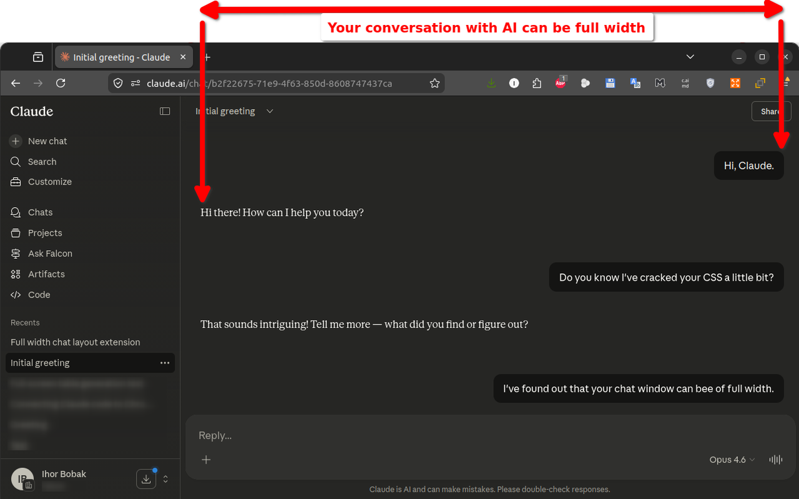

# Chrome & Firefox Plugins

You can get this extension at [Chrome Web Store](https://chromewebstore.google.com/detail/widechat-full-width-ai-ch/nblbllelpafbjfjdhidfneoajhoemgnh) or at [Firefox Browser Extensions](https://addons.mozilla.org/en-US/firefox/addon/widechat/) website.


# WideChat - Full Width AI Chat for ChatGPT, Claude, Gemini & others

Tired of the narrow chat window wasting your wide screen?

WideChat expands the conversation area in your favorite AI chats to use the full width of your monitor. No more squinting at a narrow column in the middle of the screen while the rest sits empty.

Works with:
- [ChatGPT](https://chatgpt.com)
- [Claude](https://claude.ai)
- [Gemini](https://gemini.google.com)
- [Grok](https://grok.com)
- [Qwen](https://chat.qwen.ai)
- [DeepSeek](https://chat.deepseek.com)
- [Kimi](https://kimi.ai)
- [Copilot](https://copilot.microsoft.com)

Why WideChat?
- Configurable width: choose anywhere from default to 100% full screen
- Works instantly: the chat expands automatically when you open the site
- Lightweight: WideChat only adjusts CSS, zero performance impact 
- Free and open source

Whether you're reading long AI responses, reviewing code, or having a deep conversation, WideChat gives you the screen space you paid for.

WideChat is the simple, free widescreen extension for AI chat. Install it once, and every AI chat you use gets wider immediately.

This is how it looks:



# Donations

Enjoying WideChat? If it makes your screen happier, consider [buying me a coffee ☕](https://boosty.to/ihor_bobak/donate):

[](https://boosty.to/ihor_bobak/donate)


# Manual Installation

To install the extension manually for review/experimentation purposes, first clone this repo to some folder with a command 
```bash
git clone https://github.com/ibobak/WideChat.git
```
Alternatively, you may [download Zip archive](https://github.com/ibobak/WideChat/archive/refs/heads/main.zip) and extract it on disk.

Next, depending on your browser:

## For Chrome
    
1. In your URL bar type: chrome://extensions/
2. Press "Load Unpacked", select the folder which you've just cloned or unzipped.

## For Firefox

1. In your URL bar type: about:debugging
2. Press "This Firefox"
3. Press "Load Temporary Add-on" and point to the manifest.json from the extracted folder.


# 📋 License

This project is free to use and **source-available**: the code is public for transparency and review, but it is not licensed for redistribution or modification.

You may:
- Freely use the browser extension on as many computers as you wish
- Study the source code

You may **not**:
- Fork or redistribute this code
- Create derivative works based on this code
- Republish this extension (modified or unmodified) on any extension store
- Use the name, branding, or donation links from this project

If you find a bug or want to suggest a feature, feel free to open an issue.

For permission requests, contact: [ibobak@gmail.com](ibobak@gmail.com)

# Keywords

wide chat, wider chatgpt, full width claude, expand chat area, claude wide layout, 
chatgpt full width, wider conversation, AI chat wide mode, chat widener, remove sidebar, bigger chat area


# Release Log

Release log:

- **1.1.0** 

    added support for Copilot. 

- **1.0.0**

    Initial version: supports seven AI chats.
